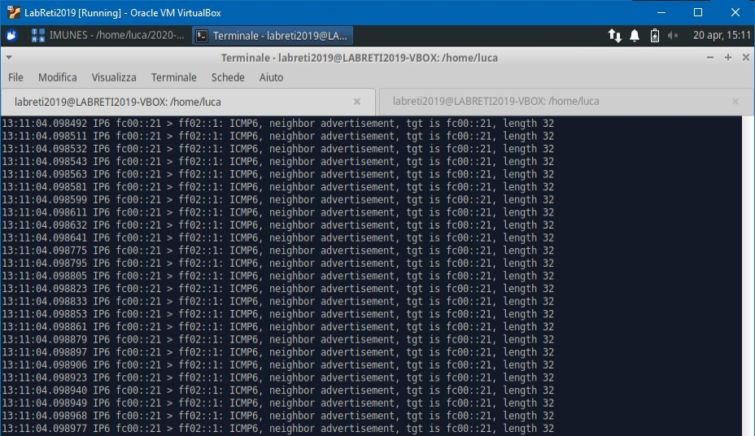
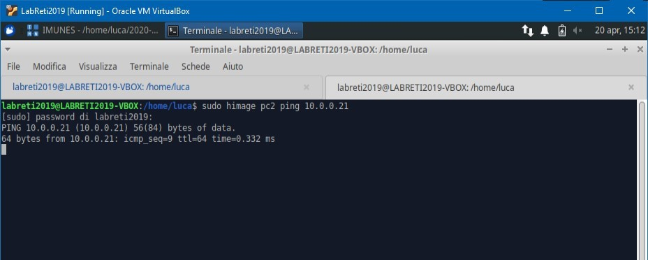
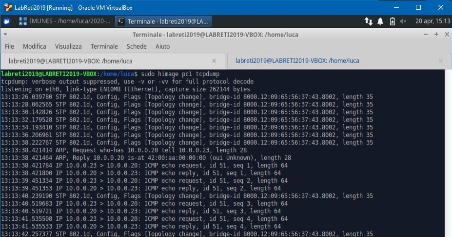
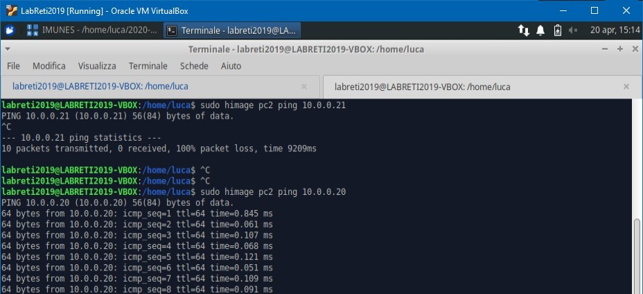

# Spanning Tree Protocol

## In uso `SpanningTreeProtocol.imn`

Se abbiamo più switch/bridge collegati tra loro in circolo i pachhetti vengono amplificati e la rete viene presto inondata da pacchetti e resa inutilizzabile.

Questo è un tcpdump della rete.  


Ping tra pc non è responsivo, rimane in attesa.  


Quindi abilitiamo STP che andrà a creare un albero di priorità tra gli swithc in modo che i pacchetti non continuino a girare tra i nodi ma seguano una strada fino al loro destinatario e basta.

```bash
ovs vsctl set bridge <bridge> stp_enable=true
```

Questo è un tcpdump della rete dopo aver abilitato STP, si può vedere il normale traffico dovuto al ping in arrivo.  


Ping normalmente funzionante.  

