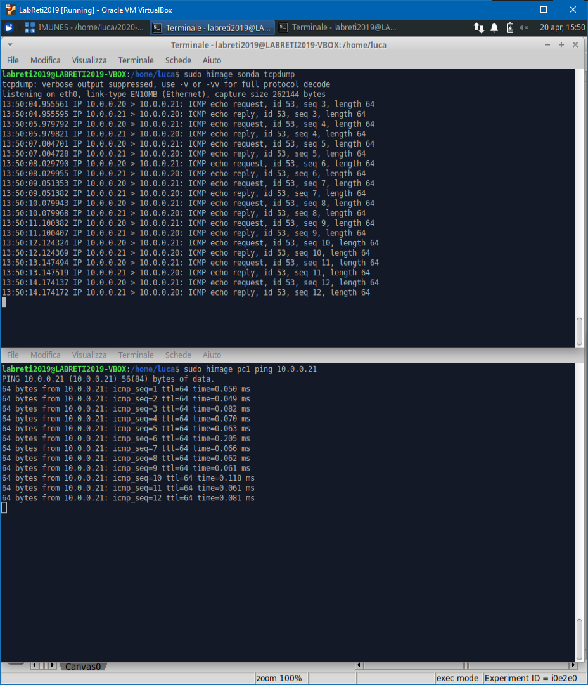

# Sonda di rete

## Teoria

Anzichè usare una scheda di rete in modalità promiscua (che potrebbe essere anche disabilitata sulla rete), andiamo a creare una sonda di rete.  

```bash
ovs-vsctl -- --id=@p get port <portaDellaSonda> -- --id=@m create mirror name=<nomeAPiacere> select-all=true output-port=@p -- set bridge <nomeDelBridge> mirrors=@m
```

Analiziamo il comando:

- `-- --id=@p get port <portaDellaSonda>`  
Stiamo ottenendo l’identificatore della porta a cui la sonda scelta è collegato e lo stiamo memorizzando nella variabile temporanea @p

- `-- --id=@m create mirror name=<nomeAPiacere> select-all=true output-port=@p`  
Stiamo creando un mirror (memorizzandone l’identificatore in @m) che cattura il traffico da tutte le porte dell'host e lo riversa nella porta @p definita in riga

- `-- --id=@p get port <portaDellaSonda>`  
Stiamo attivando il mirror @m sul bridge nomeDelBridge

### Così otteniamo che

- La sonda è in grado di vedere tutto il traffico di rete
- Tutto il traffico destinato direttamente a quell'host viene droppato (la
sonda viene esclusa dalla rete)

## In uso `SondaRete.imn`

1. Impostare la porta dello switch alla quale è collegata la sonda come porta mirror di tutto il traffico di rete (usando il comando qua sopra)

2. Porre l’interfaccia eth0 della Sonda in modalità promiscua
`sudo himage sonda ip link set promisc on dev eth0`

3. tcpdump ci fa osservare il ping tra pc1 e pc1  

